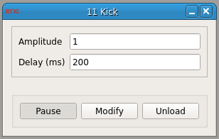

###Kick - the Manual Event Trigger

**Requirements:** None  
**Limitations:** None  

This module sends a single value as a trigger or “kick” to another module. It outputs a user-specified value when triggered and a value of 0 otherwise. It can be used to manually mark events that a user sees in the data. It’s value in the HDF5 file will then serve as an event flag. This module can also be used to manually test other modules that require a trigger (such as those accepting input from the Spike Detector module). This module only sends a single “kick” at the specified delay after it is unpaused.

####Input Channels

None

####Output Channels

1. output(0) – “Kick” : the kick amplitude of a value of ’0′ otherwise

####Parameters

1. Amplitude : the amplitude of the kick
2. Delay (ms) : the delay after the module is unpaused when the kick is given
